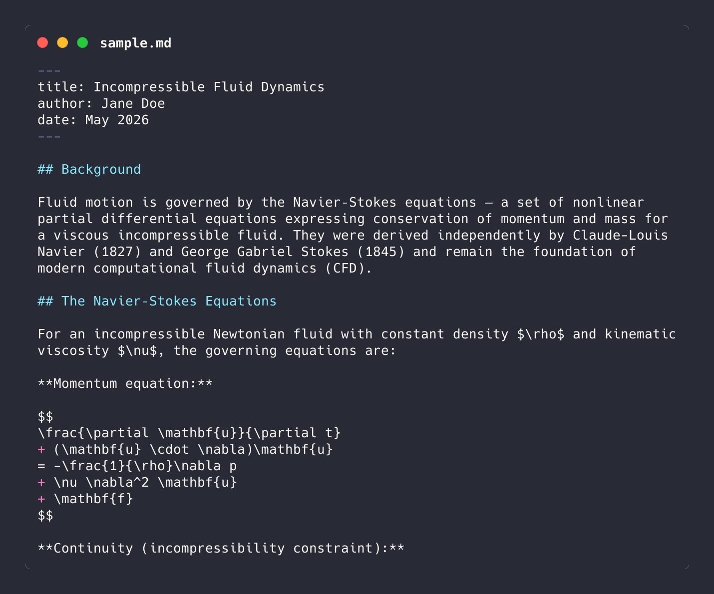
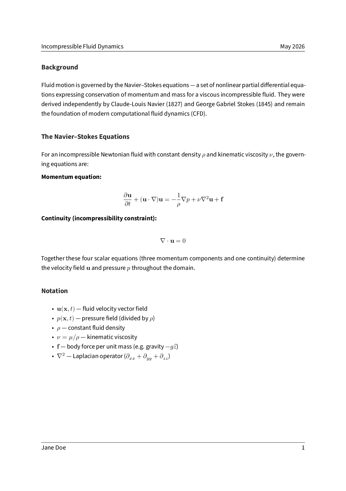

# md2pdf

Convert Markdown documents to pretty PDFs. Uses [pandoc](https://pandoc.org) + XeLaTeX + the [eisvogel](https://github.com/Wandmalfarbe/pandoc-latex-template) template.

<p align="center">
  
  
</p>
<p align="center"><sub>Left: markdown source &nbsp;|&nbsp; Right: page 1 of the generated PDF</sub></p>

Features:
- Strips leading chatbot "thinking" preambles before conversion
- Automatic `\(...\)` / `\[...\]` → `$...$` / `$$...$$` math delimiter conversion when detected
- Fixes missing blank lines before lists (common in AI-generated output)
- Batch mode with progress bar for converting multiple files at once

## Quick start

One-line install (macOS / Linux):

```sh
curl -fsSL https://raw.githubusercontent.com/rsnemmen/md2pdf/main/install.sh | bash
```

This installs pandoc, XeLaTeX, the eisvogel template, and copies `md2pdf` to `~/.local/bin`. You'll be prompted before each step.

Then:

```sh
md2pdf report.md   # produces report.pdf
```

To preview what would be installed without changing anything:

```sh
curl -fsSL https://raw.githubusercontent.com/rsnemmen/md2pdf/main/install.sh | bash -s -- --check
```

### From a clone (for contributors)

```sh
git clone https://github.com/rsnemmen/md2pdf.git
cd md2pdf
./install.sh        # installs pandoc, XeLaTeX, eisvogel, and copies md2pdf to ~/.local/bin (re-run after pulls)
```

## Usage

```
Usage: md2pdf [options] <input.md> [output.pdf]
       md2pdf [options] <input1.md> <input2.md> ...

Options:
  -s, --simple Use basic Pandoc output (no template, 1in margins)
  --compact    Use reduced margins and no running header in default mode
  --toc        Include a table of contents
  --no-toc     Do not include a table of contents (default)
  -h, --help   Show this help message and exit

Arguments:
  input.md     One or more input Markdown files (globs like *.md are fine)
  output.pdf   Output filename (single-file mode only; default: input with .pdf)
  -            Read from stdin (single-file mode only; requires explicit output.pdf)

Examples:
  md2pdf report.md                  # produces report.pdf without a TOC
  md2pdf --toc report.md            # with a TOC
  md2pdf --compact report.md        # reduced margins and no running header
  md2pdf notes.md                   # LaTeX math delimiters auto-detected and converted
  md2pdf -s notes.md                # simple template
  md2pdf notes.md out.pdf           # explicit output filename
  md2pdf a.md b.md c.md             # produces a.pdf, b.pdf, c.pdf
  md2pdf *.md                       # batch-convert all .md files
  cat notes.md | md2pdf - out.pdf   # stdin input
```

## Platform support

- **macOS** — Homebrew + BasicTeX
- **Linux** — apt (Debian/Ubuntu), dnf (Fedora/RHEL), pacman (Arch)
- **Windows** — use WSL (treated as Linux); native Windows is not supported

## Requirements

- bash 4+
- pandoc
- XeLaTeX (via BasicTeX on macOS, TeX Live on Linux)
- [eisvogel](https://github.com/Wandmalfarbe/pandoc-latex-template) template at `~/.local/share/pandoc/templates/eisvogel.latex`

The `-s` / `--simple` flag bypasses the eisvogel template entirely, so basic conversions work with just pandoc + xelatex.


### `install.sh`

The installer handles everything needed to run `md2pdf`:

| Step | macOS | Linux |
|------|-------|-------|
| pandoc | `brew install pandoc` | apt / dnf / pacman |
| XeLaTeX | `brew install --cask basictex` | texlive-xetex + extras |
| eisvogel tlmgr packages | `sudo tlmgr install ...` | covered by texlive-*-extra |
| eisvogel template | downloaded from GitHub releases | same |
| PATH copy | `~/.local/bin/md2pdf` (re-run `./install.sh` after pulls) | same |

Options:

| Flag | Effect |
|------|--------|
| `--check` | Report status without installing |
| `-y` / `--yes` | Skip all confirmation prompts |

## Testing

See [`tests/README.md`](tests/README.md) for setup and usage. Requires [bats-core](https://github.com/bats-core/bats-core):

```sh
brew install bats-core   # macOS
bats tests/              # run the full suite
```

